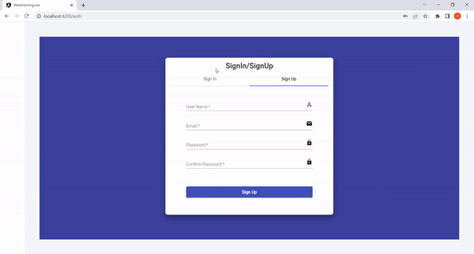
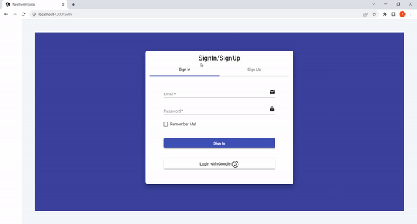
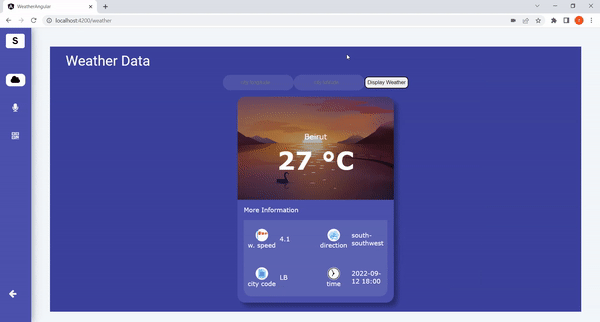
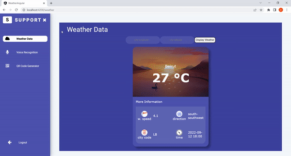
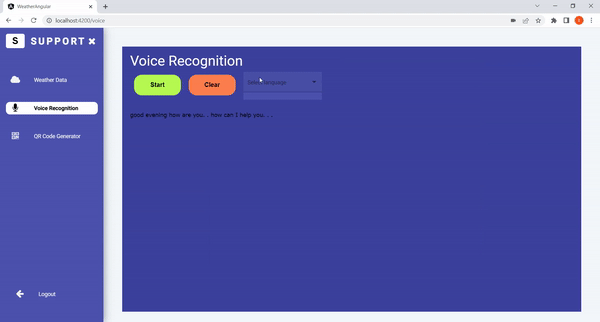

<div align="center">

> Hello world! This is the project’s summary that describes the project plain and simple, limited to the space available. 


**[PROJECT PHILOSOPHY](#-project-philosophy) • [WIREFRAMES](#-wireframes) • [TECH STACK](#-tech-stack) • [IMPLEMENTATION](#-impplementation) • [HOW TO RUN?](#-how-to-run)**
</div>

<br><br>


<br>

> Support project is implemented to provide the following services: forecast info 🌦, voice recognition 🎙, translation 📖, and generating qr code 🔲.

### User Stories
- As a user, I want to own an account and login whenever I want.
- As a user, I want to view the forecast info of any city.
- As a user, I want to replace typing by voice recognition.
- As a user, I want to translate the result of the voice recognition.
- As a user, I want to generate qr code.

<br><br>


> This design was planned before on paper, then moved to Figma app for the fine details.
Note that i didn't use any styling library or theme, all from scratch and using pure css modules
<br>
(Please note that pictures make take few seconds to open due to high quality)

### User Wireframes 💻

| Login  | Signup  |
| -----------------| -----|
|  |  |

| Forecast  | QR Code Generator  |
| -----------------| -----|
|  |  |

| Voice Recognition  | Translation  |
| -----------------| -----|
|  |  |

<br><br>


Here's a brief high-level overview of the tech stack the Support app uses:

- For persistent storage (database), the project uses the [MySQL](https://www.mysql.com/) which is a widely used relational database management system (RDBMS). It is free and open-source. MySQL is ideal for both small and large applications.
- [Laravel](https://laravel.com/) was used as backend of this project. Where Laravel is a web application php framework with expressive, elegant syntax.

- This project uses the [Angular framework](https://angular.io/guide/what-is-angular). Angular is a development platform, built on Typescript. As a platform, Angular includes: A component-based framework for building scalable web applications / A collection of well-integrated libraries that cover a wide variety of features, including routing, forms management, client-server communication, and more / A suite of developer tools to help you develop, build, test, and update your code.

<br><br>


> Using the above mentioned tech stacks and the wireframes build with figma from the user sotries we have, the implementation of the app is shown as below, these are screenshots from the real app
<br>
(Please note that the following are gifs and may take few seconds to open)

<br>

### User Web Implementation 💻

| Sign Up
| -----------------|
| 

| Sign In
| -----------------|
|  

| Forecast |
| -----------------|
|  |

| QR Code Generator
| -----------------|
|   

| Voice Recognition
| -----------------|
|  

| Translation
| -----------------|
|  

<br><br>


> This is an example of how you may give instructions on setting up your project locally.
To get a local copy up and running follow these simple example steps.

### Prerequisites

This is an example of how to list things you need to use the software and how to install them.
* npm
  ```sh
  npm install npm@latest -g
  ```

### Installation

_Below is an example of how you can instruct your audience on installing and setting up your app. This template doesn't rely on any external dependencies or services._

1. Clone the repo
   ```sh
   git clone https://github.com/Hadi-AlKammouni/Support.git
   ```
2. Install NPM packages
   ```sh
   npm install
   ```
3. To run the laravel folder 
   ```
   php artisan serve
   ```
4. To run the angular folder 
   ```
   ng serve
   ```
5. Rapid API_KEY in .env file for angular folder
   ```js
   Rapid_API_KEY = 'Enter The API KEY';
   ```